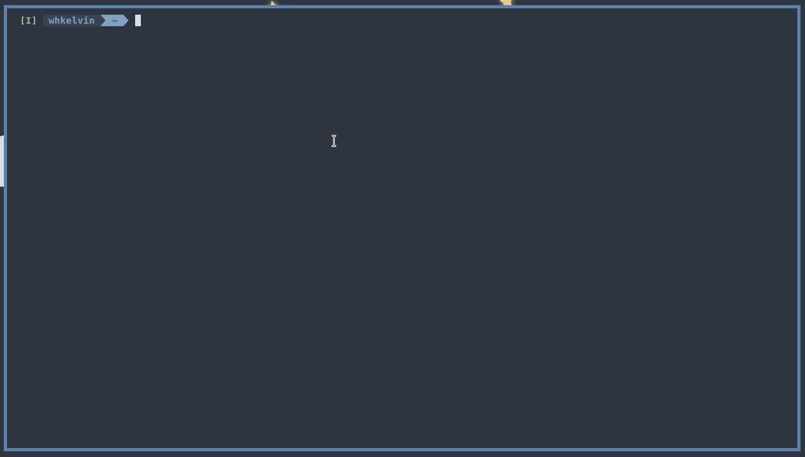

# Goldfish <><

An autocomplete tool in the terminal to help my goldfish brain ... Document shell commands and scripts and have goldfish remember them for you when you need them.


# Dependencies

- [fish shell](https://fishshell.com/) or [zsh](https://zsh.sourceforge.io/), bash is not supported rn
- [fzf](https://github.com/junegunn/fzf)
- [awk](https://man.archlinux.org/man/awk.1p.en) should be installed by default on most linux distribution and Mac OS

# Installation

## Fish

### Create ~/.config/fish/functions/configure_goldfish.fish

```
function configure_goldfish
  # This can be ran in the terminal(no escape char for fish scripting)
  # cat ~/.config/goldfish/goldfish.config | fzf --preview-window="bottom:3:wrap" --preview="echo {} | awk -F ' <>< ' '{print \$2}' | fish_indent --ansi" | awk -F ' <>< ' '{print $2}'

  alias goldfish='cat ~/.config/goldfish/goldfish.config | fzf --preview-window="bottom:3:wrap" --preview="echo {} | awk -F \' <>< \' \'{print \$2}\' | fish_indent --ansi" | awk -F \' <>< \' \'{print $2}\''

  alias goldfish-local='cat ./goldfish.config | fzf --preview-window="bottom:3:wrap" --preview="echo {} | awk -F \' <>< \' \'{print \$2}\' | fish_indent --ansi" | awk -F \' <>< \' \'{print $2}\''

  # alt + g for global goldfish, alt + h for local goldfish
  if test "$fish_key_bindings" = "fish_vi_key_bindings"
    bind -M insert \eg fzf_search_goldfish
    bind -M insert \eh fzf_search_goldfish_local
  else
    bind \eg fzf_search_goldfish
    bind \eh fzf_search_goldfish_local
  end
end
```

### Create ~/.config/fish/functions/fzf_search_goldfish.fish

```
function fzf_search_goldfish
    set command (
      goldfish
    )
    commandline --replace -- $command
    commandline --function repaint
end
```

### Creaet ~/.config/fish/functions/fzf_search_goldfish_local.fish

```
function fzf_search_goldfish_local
    set command (
      goldfish-local
    )
    commandline --replace -- $command
    commandline --function repaint
end
```

### Add to ~/.config/fish/config.fish

```
configure_goldfish
```

## ZSH

Add to ~/.zshrc

```
alias goldfish=$'cat ~/.config/goldfish/goldfish.config | fzf --preview-window=\'bottom:3:wrap\' --preview="echo {} | awk -F \' <>< \' \'{print $2}\'" | awk -F \' <>< \' \'{print $2}\''
alias goldfish-local=$'cat ./goldfish.config | fzf --preview-window=\'bottom:3:wrap\' --preview="echo {} | awk -F \' <>< \' \'{print $2}\'" | awk -F \' <>< \' \'{print $2}\''

goldfish-widget ()
{
  zle .kill-whole-line
  local selection=$(goldfish)
  #zle -U $selection
  BUFFER=$selection
  zle end-of-line
}

goldfish-widget-local ()
{
  zle .kill-whole-line
  local selection=$(goldfish-local)
  #zle -U $selection
  BUFFER=$selection
  zle end-of-line
}

zle -N goldfish-widget
zle -N goldfish-widget-local

bindkey '\eg' goldfish-widget
bindkey -M viins '\eg' goldfish-widget
bindkey -M vicmd '\eg' goldfish-widget
bindkey -M emacs '\eg' goldfish-widget

bindkey '\eh' goldfish-widget-local
bindkey -M viins '\eh' goldfish-widget-local
bindkey -M vicmd '\eh' goldfish-widget-local
bindkey -M emacs '\eh' goldfish-widget-local
```

# Configuration

Create ~/.config/goldfish/goldfish.config or alternatively create a goldfish.config in any folder you'd like to run it.

```
Git: Stage All <>< git add -A
Git: Commit <>< git commit -m "{commit message here}"
Git: Show Repo Status <>< git status
```

# Usage

By default:
`alt+g` will bring up goldfish in the terminal containing items defined in `~/.config/goldfish/goldfish.config`
`alt+h` will bring up goldfish in the terminal containging items defined in `./goldfish.config`

The keybindings are configured in the shell scripts as `\eg`, replace all occurances with whatever key-bindings want! Ctrl should be `\c` in fish and `^` in zsh, but RTFM :stuck_out_tongue_closed_eyes:

# Note

- On mac OS, you might need to set `use alt key as meta key` in your terminal emulator for alt shortcut to work.
